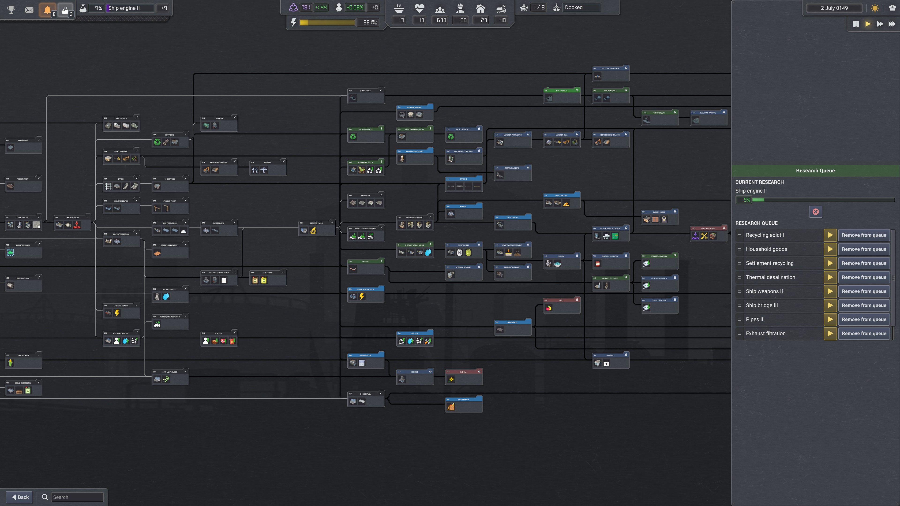

# Research Queue

A mod for **Captain of Industry** (Update 4+) that lets you manager your research queue within the research tree.



## Features

- Drag-and-drop reordering of your research queue
- Panel injected directly into the research tree screen
- Works on existing saves
- Safe to remove. Your queue stays in whatever order you left it

## Installation

1. Download the latest release (or build from source -- see below)
2. Copy the **`ResearchQueue`** folder into your mods directory:
   ```
   %APPDATA%\Captain of Industry\Mods\
   ```
   The final structure should look like:
   ```
   Captain of Industry\Mods\ResearchQueue\
       ResearchQueue.dll
       manifest.json
   ```
3. Launch the game -- the mod will appear in the mod list on the main menu
4. Enable the mod and load (or start) a game
5. Open the research tree (beaker icon) -- the reorder panel appears on the left side

### Finding your Mods folder

Press `Win + R`, paste this path, and hit Enter:
```
%APPDATA%\Captain of Industry\Mods
```
If the `Mods` folder doesn't exist yet, create it.

## Building from Source

### Prerequisites

- [.NET Framework 4.8 SDK](https://dotnet.microsoft.com/download/dotnet-framework)
- Captain of Industry installed (Steam)
- Environment variable `COI_ROOT` set to your game install directory
  (e.g., `C:\Program Files (x86)\Steam\steamapps\common\Captain of Industry`)

### Build

```
dotnet build /p:LangVersion=latest
```

The build automatically deploys the mod to your `%APPDATA%\Captain of Industry\Mods\ResearchQueue\` folder.

## Compatibility

- **Game version:** Update 4+ (0.4.0 through 0.8.2c verified)
- **Save compatibility:** Works on existing saves. Safe to add or remove mid-playthrough.

## Author

**Jagg111**

## License

This mod is provided as-is for personal use. Feel free to learn from the code or adapt it for your own mods.
