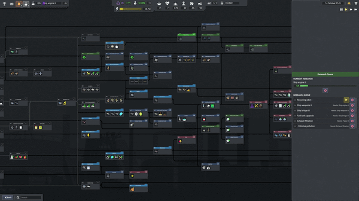

<div align="center">

# 🔬 Research Queue (Captain of Industry Mod)

### Stop rebuilding your entire queue when you want to change it. Manage your queue directly in the research tree.


[](https://github.com/Jagg111/COI-ResearchQueue/releases/latest)
[](https://store.steampowered.com/app/1594320/Captain_of_Industry/)

**[⬇️ Download Latest Version](https://github.com/Jagg111/COI-ResearchQueue/releases/latest)**
</div>

## 🎯 Why This Mod?

Without this mod, if you want to start a new research your only option is to blow out your enitre queue then add items back in one by one to rebuild your queue.There's also no way to rearrange your queue... 😩

**The Research Queue mod** solves this by adding a queue management panel directly inside the research tree.

## ✨ Features

- 🎨 **Integrated UI** - panel appears directly inside the research tree and feels like a native feature of Captain of Industry
- 🔀 **Drag-and-drop reordering** of your research queue
- 📊 **Live research visibility** - see what's actively being researched and its progress
- 💾 **Works on existing saves** - install and go, no new game required


## 📦 Installation

1. **[⬇️ Download the latest release](https://github.com/Jagg111/COI-ResearchQueue/releases/latest)** (`.zip` file)
2. Extract the zip file
3. Copy the **`ResearchQueue`** folder into your mods directory:
   ```
   %APPDATA%\Captain of Industry\Mods\
   ```
   Your folder structure should look like this:
   ```
   Captain of Industry\Mods\ResearchQueue\
       ResearchQueue.dll
       manifest.json
   ```
4. Launch the game and enable the mod when loading your save. In game open the research tree (hotkey `G` by default) - the queue panel appears on the right side when no research nodes are selected.

<details>
<summary><strong>📁 Can't find your Mods folder?</strong></summary>

Press `Win + R`, paste this path, and hit Enter:
```
%APPDATA%\Captain of Industry\Mods
```
If the `Mods` folder doesn't exist yet, create it.

</details>

## 🔧 Compatibility

| | |
|---|---|
| 🎮 **Game version** | Update 4+ (0.8.2c verified) |
| 💾 **Save compatible** | Yes |
| 🛡️ **Safe to remove** | Yes |
| 🤝 **Other mods** | No known conflicts (yet) |

## ❓ FAQ

**Does this work with existing saves?**  
✅ Yes! Just install and enable it when loading your save. No new game needed.

**What happens if I remove the mod?**  
✅ Your queue stays exactly as-is. You just lose the panel and interface for managing it.

**Does this conflict with other mods?**  
✅ No known conflicts. If you encounter any issues, please [let me know](https://github.com/Jagg111/COI-ResearchQueue/discussions/new?category=bug-reports)!

**Is this mod safe? Does it modify save files?**  
✅ The mod uses the game's existing research queue data. It does not create its own save data or modify save files directly—it only changes the order of items already in the queue.

</details>

## 🐛 Feedback & Bug Reports

Found a bug or have a suggestion? Join the [dicussions on GitHub](https://github.com/Jagg111/COI-ResearchQueue/discussions)!

## 📋 Changelog

See the [Releases page](https://github.com/Jagg111/COI-ResearchQueue/releases) for version history and download links.

## ⭐ Support

If you find this mod useful, consider starring the repo ⭐ — it helps others discover it!

## 🙏 Credits

- Built with the [Mafi modding framework](https://github.com/MaFi-Games/Captain-of-industry-modding) by MaFi Games
- Developed by [Jagg111](https://github.com/Jagg111) with [Claude Code](https://claude.com/product/claude-code)