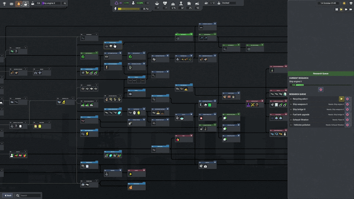

<div align="center">

# 🔬 Research Queue (Captain of Industry Mod)

### Stop rebuilding your entire queue when you change your mind. Manage your queue directly in the research tree.


**[⬇️ Get it on the COI Mod Hub](https://hub.coigame.com/Mod/17)**

<sub>[](https://github.com/Jagg111/COI-ResearchQueue/releases/latest)</sub>
</div>

## 🎯 Why This Mod?

Without this mod, if you have a queue and want to start new research, your only option is to clear your entire queue and rebuild it one item at a time. There's also no way to rearrange your queue... 😩

**The Research Queue mod** solves this by adding a queue management panel directly inside the research tree.

## ✨ Features

- 🎨 **Integrated UI** - panel appears directly inside the research tree and feels like a native feature
- 🔀 **Drag-and-drop reordering** of your research queue
- 🖱️ **Start or remove items** - buttons to manage items directly in the queue
- 📊 **Live research visibility** - see what's actively being researched and its progress
- 💾 **Works on existing saves** - install and go, no new game required

## 🔔 Updates & Changelog

- The mod is published on the [COI Mod Hub](https://hub.coigame.com/Mod/17), which handles updates automatically.
- New versions are also mirrored to the [GitHub Releases page](https://github.com/Jagg111/COI-ResearchQueue/releases) as a backup. If you already follow this repo, click **"Watch" → "Custom → Releases"** to get notified.

## 📦 Installation

### Recommended: COI Mod Hub (one-click)

1. Open the [Research Queue mod page on the COI Mod Hub](https://hub.coigame.com/Mod/17) and follow the install instructions there.
2. Launch the game, but **do NOT click Continue** - you don't get the option to enable mods there - **click Load**
3. Click the **"Mods & DLCs"** button, enable the mod, then load your save.

Once in-game, open the research tree and the queue panel will appear when no research nodes are selected.

### Backup: Manual install from GitHub

If you can't use the hub, you can install the mod manually:

1. **[⬇️ Download the latest release](https://github.com/Jagg111/COI-ResearchQueue/releases/latest)** (`.zip` file)
2. Extract the zip file
3. Copy the **`ResearchQueue`** folder into your mods directory:
   ```
   %APPDATA%\Captain of Industry\Mods\
   ```
   *💡 Tip: press `Win + R`, paste the path above, and hit Enter to jump straight there.*

   Your Mods folder structure should look like this:
   ```
   Mods\ResearchQueue\
       ResearchQueue.dll
       manifest.json
   ```
4. Launch the game and enable the mod as described above.

## ⭐ Support

If you find this mod useful, consider starring the repo ⭐ - it helps others discover it!

## 🔧 Compatibility

| | |
|---|---|
| 🎮 **Game version** | Update 4+<br>(0.8.4 verified) |
| 💾 **Save compatible** | Yes |
| 🛡️ **Safe to remove** | Yes |
| 🤝 **Other mods** | No known conflicts |

## ❓ FAQ

**Does this work with existing saves?**  
✅ Yes! Just install and enable it when loading your save. No new game needed.

**What happens if I remove the mod?**  
✅ Your queue stays exactly as-is. You just lose the panel and interface for managing it.

**Does this conflict with other mods?**  
✅ No known conflicts. If you encounter any issues, please [let me know](https://github.com/Jagg111/COI-ResearchQueue/discussions/new?category=bug-reports)!

**Is this mod safe? Does it modify save files?**  
✅ The mod uses the game's existing research queue data. It does not create its own save data or modify save files directly - it only changes the order of items already in the queue.

## 🐛 Feedback & Bug Reports

Got a suggestion or found a bug? Hop over to [discussions](https://github.com/Jagg111/COI-ResearchQueue/discussions) and let me know!

---

<sub>This mod follows the official Captain of Industry [modding policy](https://www.captain-of-industry.com/modding-policy).</sub>

